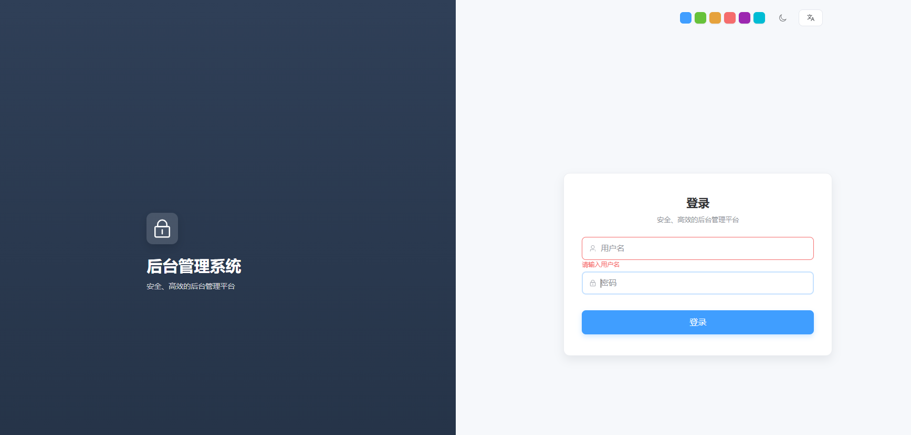
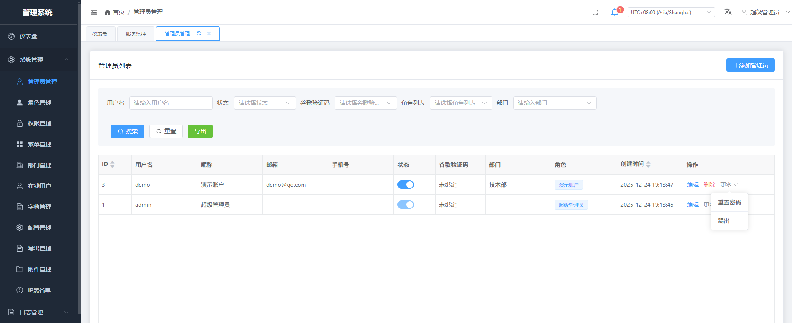
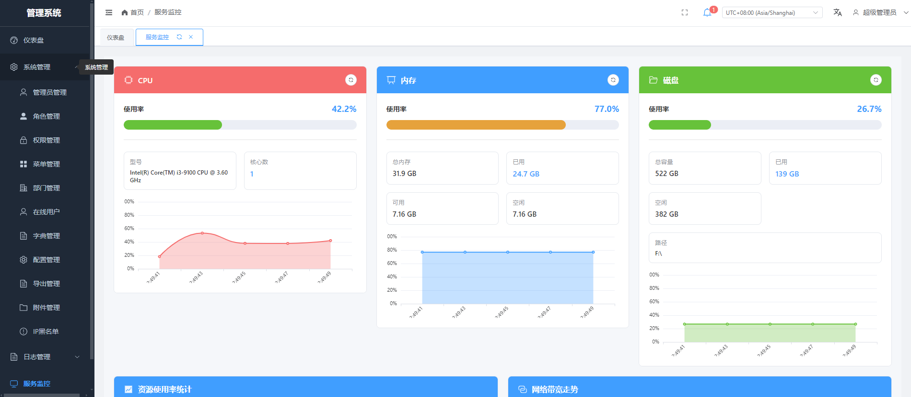
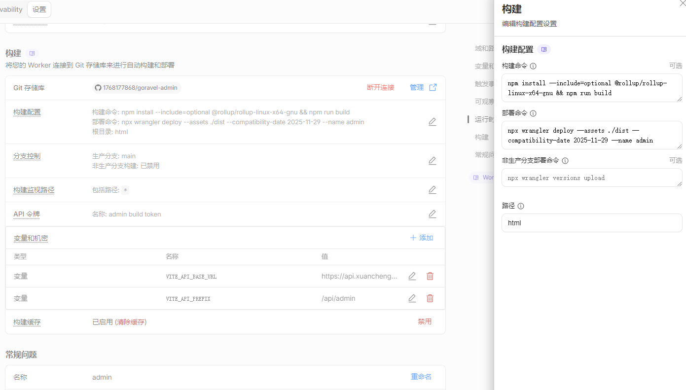

<p align="center"></p>

English | [中文](./README_zh.md)

## About Goravel

Goravel is a web application framework with complete functions and good scalability. As a starting scaffolding to help Gopher quickly build their own applications.

The framework style is consistent with [Laravel](https://github.com/laravel/laravel), let Phper don't need to learn a new framework, but also happy to play around Golang! Tribute Laravel!

Welcome to star, PR and issues！

## Admin System

This project includes a complete admin management system built with Goravel framework.

```bash
git clone https://github.com/1768177868/goravel-admin.git
```

> Demo https://admin.xuancheng888.top 

username: demo  
password: demo123

### Screenshots

<p align="center">
  
  <p align="center">Login Page</p>
</p>

<p align="center">
  
  <p align="center">Admin Dashboard</p>
</p>

<p align="center">
  
  <p align="center">System Monitoring</p>
</p>

<p align="center">
  
  <p align="center">cloudflare</p>
</p>

### Features

#### Core Modules
- **Authentication & Authorization**
  - JWT-based authentication
  - Role-based access control (RBAC)
  - Permission management
  - Multi-token management
  - Online user monitoring and kick-out

- **Admin Management**
  - Admin user management
  - Department management
  - Role management
  - Permission assignment
  - Password reset

- **System Configuration**
  - Menu management (dynamic menu)
  - Dictionary management
  - System configuration
  - Blacklist management

- **Logging & Monitoring**
  - Operation logs (with automatic recording)
  - Login logs
  - System logs (with trace ID)
  - Service monitoring

- **Additional Features**
  - Dashboard with statistics
  - Notification center (WebSocket real-time notifications)
  - Data export management
  - Multi-language support (Chinese/English)
  - Responsive UI design

### Tech Stack

**Backend:**
- Goravel Framework (Go)
- RBAC Permission System
- WebSocket Support
- Database Migrations & Seeders

**Frontend:**
- Vue 3
- Element Plus
- vxe-table (Advanced table component)
- Vue Router
- Pinia (State management)
- Axios
- ECharts (Data visualization)
- vue-i18n (Internationalization)

### Quick Start

1. **Backend Setup:**
   ```bash
   # Install dependencies
   go mod tidy
   
   # Configure database in .env
   # Run migrations and seeders
   go run . artisan migrate
   go run . artisan db:seed
   
   # Start server
   go run . --no-ansi
   # or use air for live reload
   air
   ```

2. **Frontend Setup:**
   ```bash
   cd html
   
   # Install dependencies
   npm install
   
   # Configure API address in .env
   # VITE_API_BASE_URL=http://127.0.0.1:3000
   # VITE_API_PREFIX=/api/admin
   
   # Start development server
   npm run dev
   ```

3. **Default Login:**
   - Username: `admin`
   - Password: `admin123`
   - (Please change the default password after first login)

### Build & Deployment

For detailed build and deployment instructions, including cross-platform compilation, Docker deployment, and systemd service setup, please refer to [BUILD.md](./BUILD.md).

### API Documentation

The admin API endpoints are prefixed with `/api/admin`. All endpoints require JWT authentication except login and captcha.

For detailed API documentation, see [routes/admin.go](./routes/admin.go)

#### Swagger API Documentation

The project includes Swagger API documentation for interactive API exploration.

**Access Swagger Documentation:**

The Swagger JSON document is available at:
- Local development: `http://localhost:3000/swagger/index.html`
- Production: `https://your-domain.com/swagger/index.html`

**Regenerate Swagger Documentation:**

After modifying API routes or adding new endpoints, regenerate the Swagger documentation:

```bash
# Generate Swagger documentation
swag init
```

This will regenerate the `docs/docs.go`, `docs/swagger.json`, and `docs/swagger.yaml` files based on the Swagger annotations in your code (see `main.go` for example annotations).

### Project Structure

```
.
├── app/
│   ├── http/
│   │   ├── controllers/admin/    # Admin controllers
│   │   ├── middleware/           # Custom middleware (JWT, Permission, OperationLog)
│   │   └── helpers/              # Helper functions
│   ├── models/                   # Database models
│   └── services/                 # Business logic services
├── routes/
│   └── admin.go                  # Admin routes
├── database/
│   ├── migrations/               # Database migrations
│   └── seeders/                  # Database seeders
├── html/                         # Frontend Vue application
│   └── src/
│       ├── views/                # Page components
│       ├── components/           # Reusable components
│       ├── api/                 # API client
│       └── store/               # Pinia stores
├── config/                       # Configuration files
├── BUILD.md                      # Build and deployment documentation
└── images/                       # Screenshots
```

### Database Sharding

The project supports monthly sharding strategy and has implemented monthly sharding for order tables. To add sharding functionality for other tables, follow these steps:

#### 1. Define Table Creation Function in Migration

Add a function to create sharded tables in the corresponding migration file, for example `database/migrations/20250128000001_create_orders_table.go`:

```go
// CreateOrdersShardingTable creates a sharded order table (called by service and command layers)
func CreateOrdersShardingTable(tableName string) error {
	return facades.Schema().Create(tableName, func(table schema.Blueprint) {
		table.BigIncrements("id")
		table.String("order_no", 50).Comment("Order No.")
		// ... other field definitions
		table.Index("order_no")
		table.Comment(fmt.Sprintf("Order Table - %s", tableName))
	})
}
```

#### 2. Register Table Creator in ShardingService

Register the table creation function in `app/services/sharding_service.go` in the `registerOrderTables` method (or create a new registration method):

```go
// registerOrderTables registers order table creation functions
func (s *ShardingServiceImpl) registerOrderTables() {
	// Register order main table (calls function from migrations)
	s.RegisterTableCreator("orders", migrations.CreateOrdersShardingTable)
	
	// Register order details table (calls function from migrations)
	s.RegisterTableCreator("order_details", migrations.CreateOrderDetailsShardingTable)
}
```

#### 3. Use Sharding in Service Layer

Use `ShardingService` in the service layer to ensure sharded tables exist:

```go
// Ensure sharded table exists (uses order's created_at)
now := time.Now().UTC()
tableName := utils.GetShardingTableName("orders", now)
if err := s.shardingService.EnsureShardingTable(tableName, "orders"); err != nil {
	return err
}

// Query using sharded table
facades.Orm().Query().Table(tableName).Where("id", orderID).First(&order)
```

#### 4. Create Sharding Table Command (Optional)

If you need to manually create sharded tables, you can refer to `app/console/commands/create_order_sharding_tables.go` to create a similar command.

#### 5. Scheduled Task (Optional)

Add a scheduled task in `app/console/kernel.go` to automatically create future sharded tables:

```go
// Execute on the 1st of each month at 01:00, create next month's order sharded tables
facades.Schedule().Command("order:create-sharding-tables --months=1 --month=" + time.Now().AddDate(0, 1, 0).Format("200601")).MonthlyOn(1, "01:00").OnOneServer()
```

#### Notes

- The sharding key field uses `created_at` (automatically provided by `orm.Model`), which is of type `time.Time`
- When querying data across months, you need to query multiple sharded tables and merge the results (already implemented in `OrderService`)
- Sharded table name format: `{base_table_name}_{YYYYMM}`, e.g., `orders_202501`
- Table structure definitions are unified in migrations for easy maintenance and version control
- The year-month information in the order number can directly locate the sharded table, improving query efficiency

### Security Features

- JWT token-based authentication
- Permission middleware for route protection
- Automatic operation logging
- Sensitive data filtering in logs
- Rate limiting on login endpoints
- Blacklist management for IP/Admin blocking
- Token revocation support

## Getting Started

### Start Service

`go run . --no-ansi` or `air`

[About air]: https://www.goravel.dev/getting-started/installation.html#live-reload


### Cloudflare Workers Deployment

Deploy the frontend application to Cloudflare Workers:

```bash
# Build the frontend application
cd html
# Note: Cloudflare Workers build environment automatically runs npm ci
# If you encounter Rollup optional dependency issues, use the following build command:
npm install --include=optional @rollup/rollup-linux-x64-gnu && npm run build

# Or use the project's CI build script:
npm run build:ci

# Deploy to Cloudflare Workers
npx wrangler deploy --assets ./dist --compatibility-date 2025-11-29 --name admin
```

**Configuration:**

- **Root directory:** `html`
- **Environment variables (Variables & Secrets):**
  - `VITE_API_BASE_URL`: `https://api.xuancheng888.top`
  - `VITE_API_PREFIX`: `/api/admin`
- **Custom domain:** `admin.xuancheng888.top`

**Note:** The `worker.js` file automatically handles SPA routing by returning `index.html` when a file doesn't exist.

### Performance Profiling

pprof is available at: http://localhost:3000/debug/pprof/

### Binary Compression

To reduce the binary size, you can use UPX (Ultimate Packer for eXecutables) to compress the compiled executable:

**Windows:**

1. Download UPX (Windows 64-bit version):
   - Official download: https://github.com/upx/upx/releases/latest
   - Select `upx-5.0.2-win64.zip` (or the latest version)
   - Extract the zip to a path without Chinese characters or spaces (e.g., `F:\tools\upx`)
   - Ensure `upx.exe` is accessible

2. Compress the binary (PowerShell):
   ```powershell
   # Option 1: Temporarily add UPX to PATH (recommended)
   $env:PATH += ";F:\tools\upx"
   
   # Navigate to project directory
   cd F:\www\go\admin\goravel-admin
   
   # Maximum compression level (-9)
   upx -9 main
   ```

**Linux/macOS:**

```bash
# Install UPX (if not already installed)
# Ubuntu/Debian: sudo apt-get install upx
# macOS: brew install upx

# Compress the binary
upx -9 main
```


## Documentation

### Project Documentation

| Document | Description |
|----------|-------------|
| [API.md](./docs/API.md) | Complete API reference with examples |
| [ARCHITECTURE.md](./docs/ARCHITECTURE.md) | System architecture and design |
| [CONTRIBUTING.md](./CONTRIBUTING.md) | Contribution guidelines |
| [TESTING.md](./TESTING.md) | Testing guide (unit & integration) |
| [BUILD.md](./BUILD.md) | Build and deployment |
| [CHANGELOG.md](./CHANGELOG.md) | Version history |
| [Frontend Guide](./html/DEVELOPMENT.md) | Frontend development guide |

### Goravel Framework

Online documentation [https://www.goravel.dev](https://www.goravel.dev)

> To optimize the documentation, please submit a PR to the documentation
> repository [https://github.com/goravel/docs](https://github.com/goravel/docs)

## Group

Welcome more discussion in Discord.

[https://discord.gg/cFc5csczzS](https://discord.gg/cFc5csczzS)

## License

The Goravel framework is open-sourced software licensed under the [MIT license](https://opensource.org/licenses/MIT).
